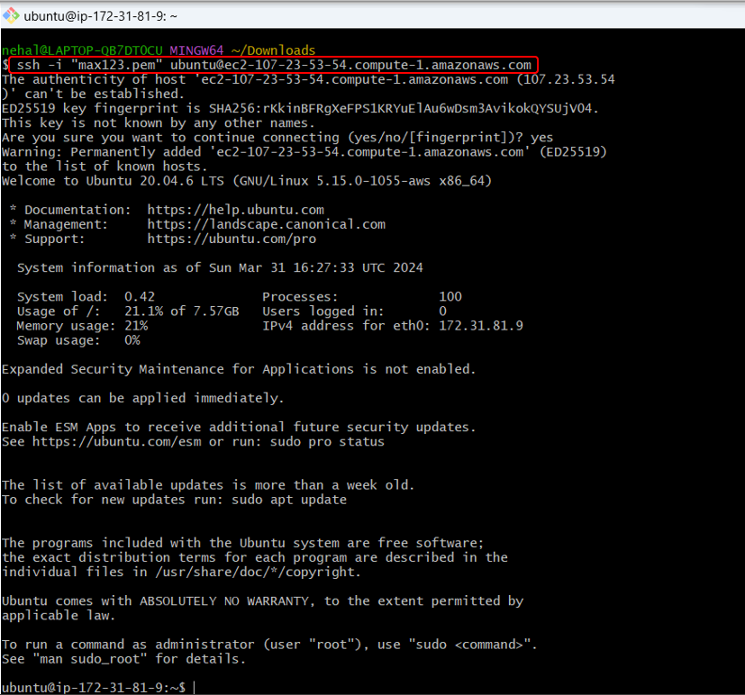

# Upgrade Ubuntu On My EC2 Instance From One LTS Version To Another

-	Upgrade from LTS Ubuntu version 20.04 to the version 22.04

**1. Create EC2 Instance, Select AMI Ubuntu Server 20.04 and click on Launch Instance**

**2. Ssh the instance**

**3. To verify the current release, run the `hostname –all | grep OperatingSystem` command**

**4. To Install all the available updates for our LTS version, run the `sudo apt update`**

**5. After Update successfully run the `sudo apt upgrade` command**

**6. Reboot the server(Go to Instance page select our EC2 Instance then in Instance state drop menu select `Reboot instance`)**

**7. The `do-release-upgrade` command perform checks to verify that the system is ready to update** 
-	Review the changes, and the enter y
-	Package configuration press enter
-	Configuring openssh -server press enter
-	Then select the `Install the package maintainer’s` and press enter
-	Then In the prompt to reboot the system enter `y`

**8. In the prompt to reboot the system enter `y` (The upgrade isn’t complete until we reboot the instance)**

**9. To verify the LTS Ubuntu version, run the `cat /etc/os-release` command(We can see that the version of Ubuntu is `22.04`)**

