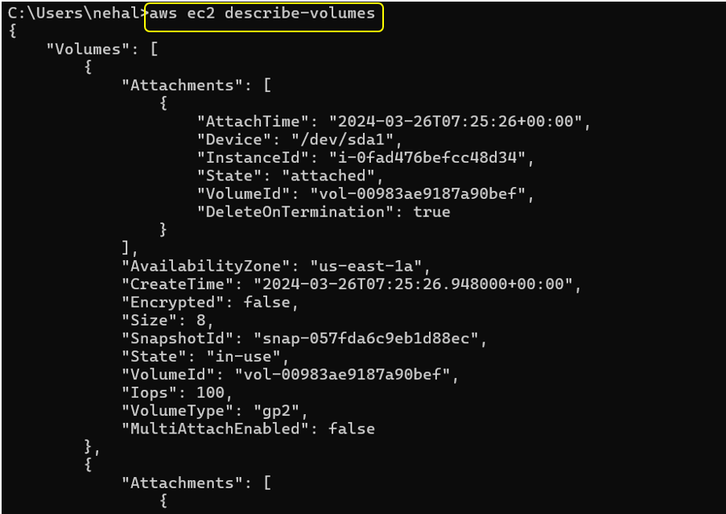

# Create And Attached EBS Volume Using AWS CLI

**1. Create one EC2 Instance**

**2. Check volume Availability zone(us-east-1a)**

**3. Then ssh the instances**

**4.  After that open CMD and type: `aws configure`**

- Enter AWS Access Key ID

- Enter AWS Secret Access Key

**5. For creating EBS Volume type: `aws ec2 create-volume --availability-zone us-east-1a --size 10`**

- `aws ec2 create-volume`: Specifies the service(EC2)
- `--availability-zone us-east-1a`: This defines the Availability zone
- `--size 10`: This sets the volume size in GiB

**6. Go to aws volume page, we can see the Created Volume**

**7. After that Attaching this volume to the instance for that purpose copy the instance ID**

**and then in cmd type: `aws ec2 attach-volume --volume-id vol-0ec0f159233f2b913 --instance-id i-042aa763d9c177df7 --device /dev/s
df`**

**8. Go to instances page and check our volume is attached to the particular instance**

**9. For checking whichever volumes attached to the particular instance then type: `aws ec2 describe-volumes`**

