# Cloud Watch Alarm

**1. Create one EC2 Instance** 

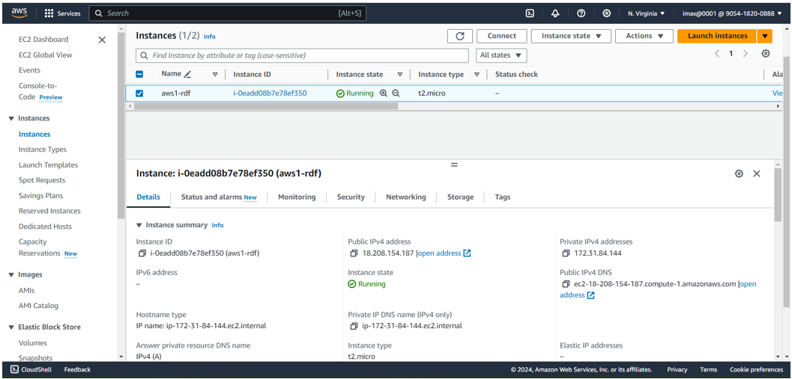

**2. Search `Cloud Watch` in search bar and click on that**

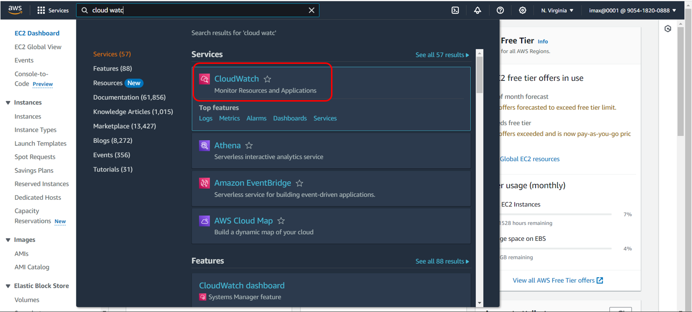

**3. Click on `Create alarm`**

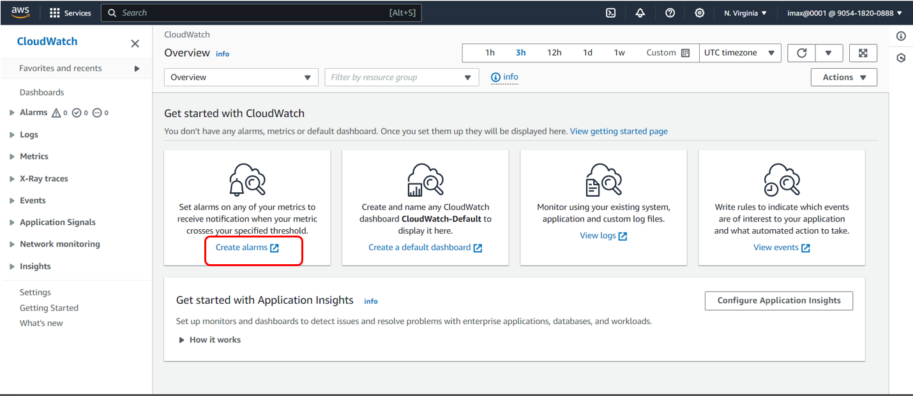

**4. Again click on `Create alarm`**

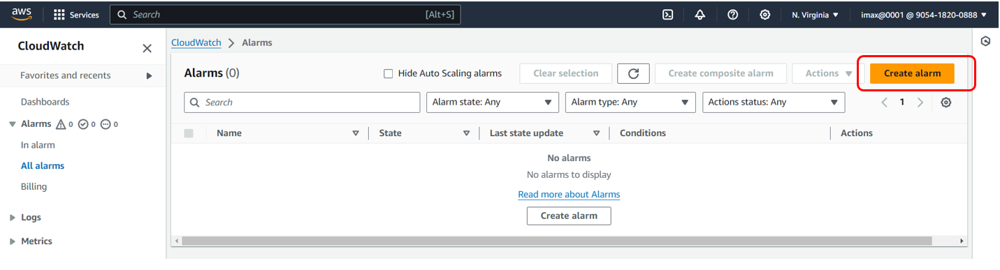

**5. After that click on `Select metrics`**

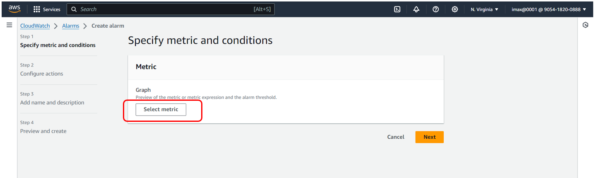

**6. Click on `EC2` and then click on `Per-Instance Metrics`**

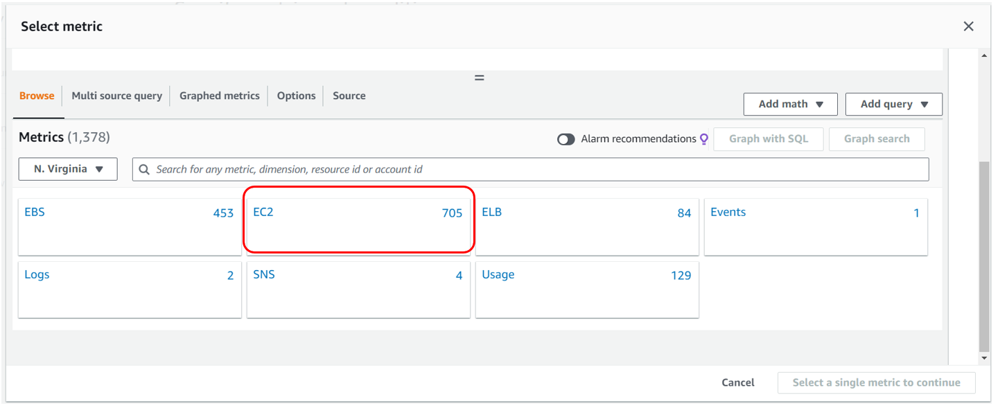
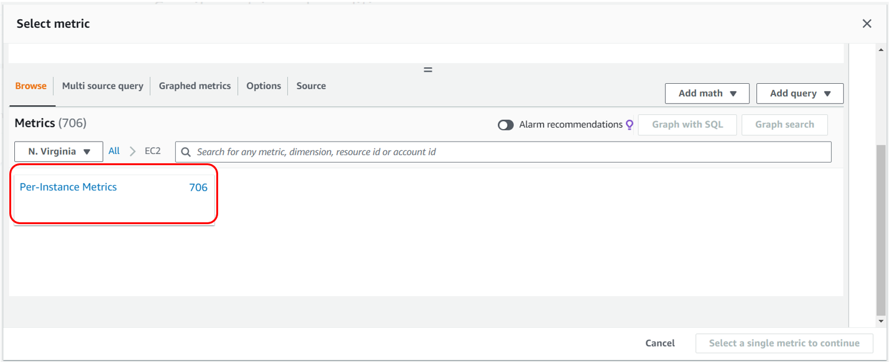

**7. Search our EC2 instance and select `Source: CUP Utilization`**

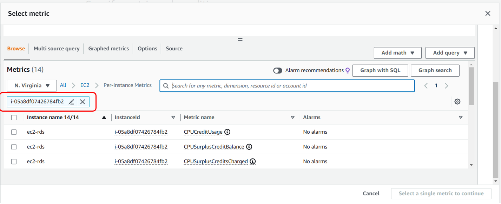
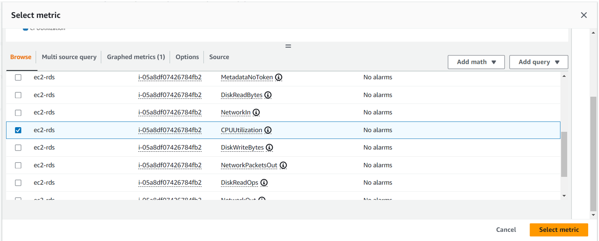

**8. set Conditions and click on Next button**

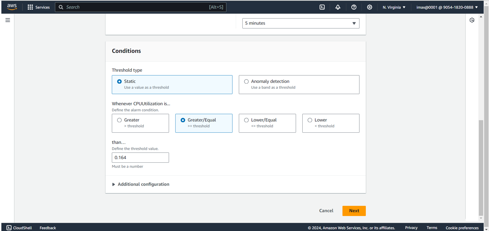

**9. In Configure Actions: Select `Create new topic` and then give topic name, put our email id where we can receive the notification and then click on `create topic`**

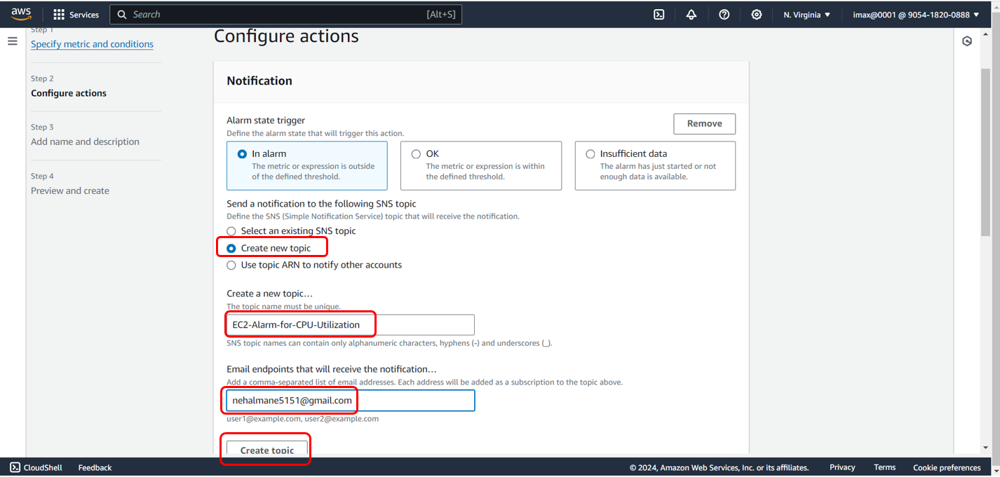

**10. default Auto Scaling, EC2 action and System Manager action and click on `Next` button**

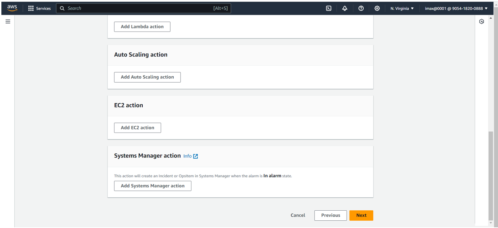

**11. Enter Alarm Name and click on Next button**

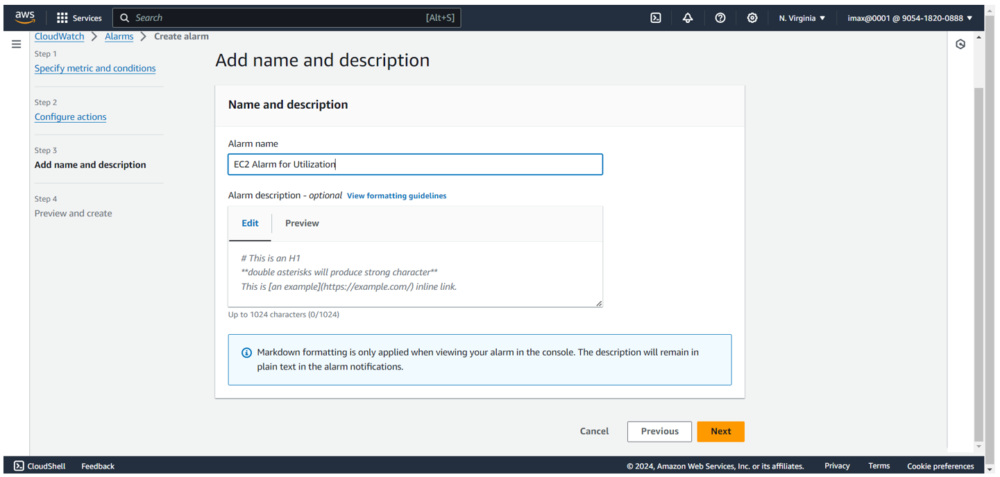

**12. check metrics and click on `Create alarm`**

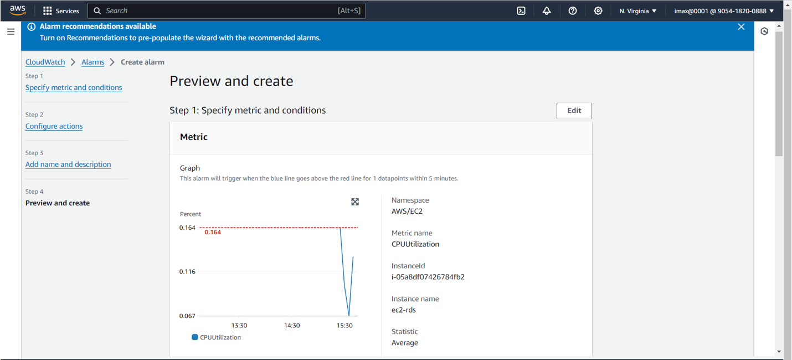
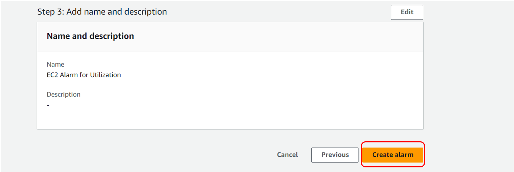