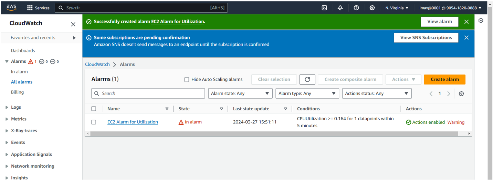
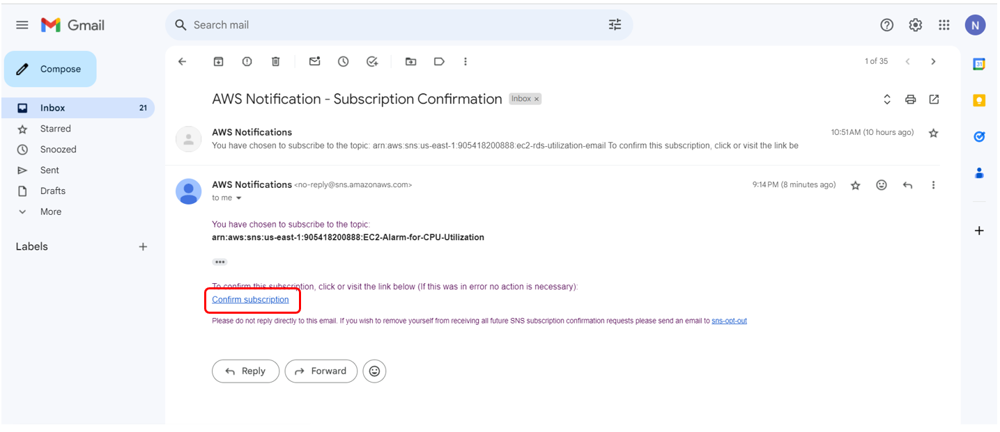
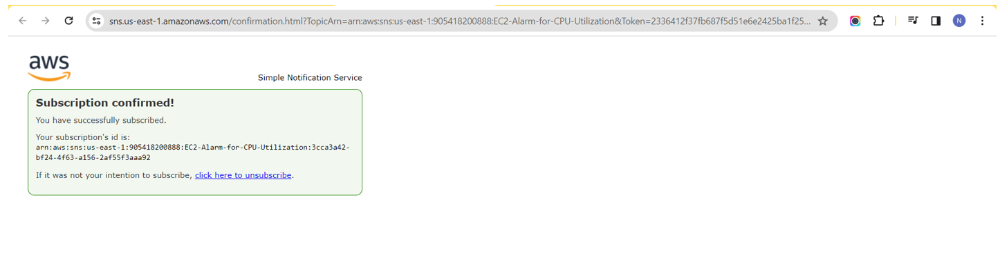
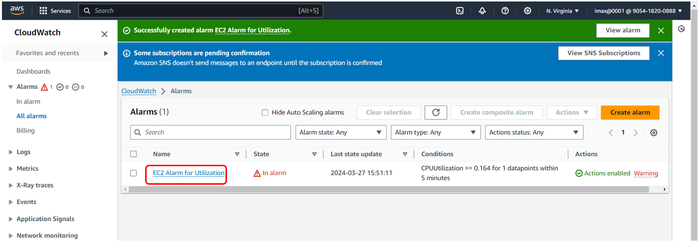
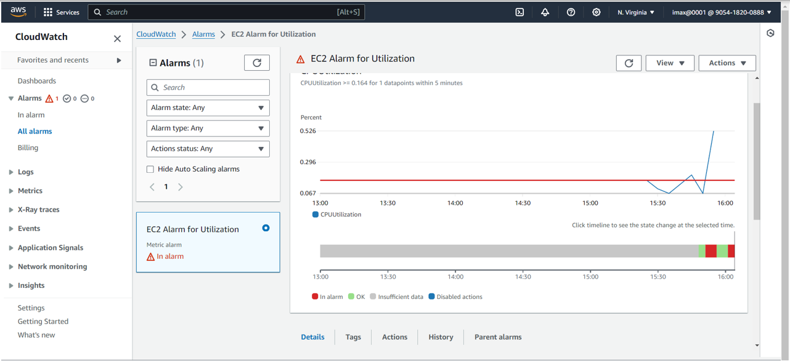
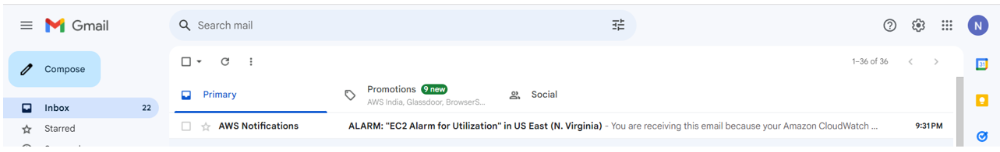
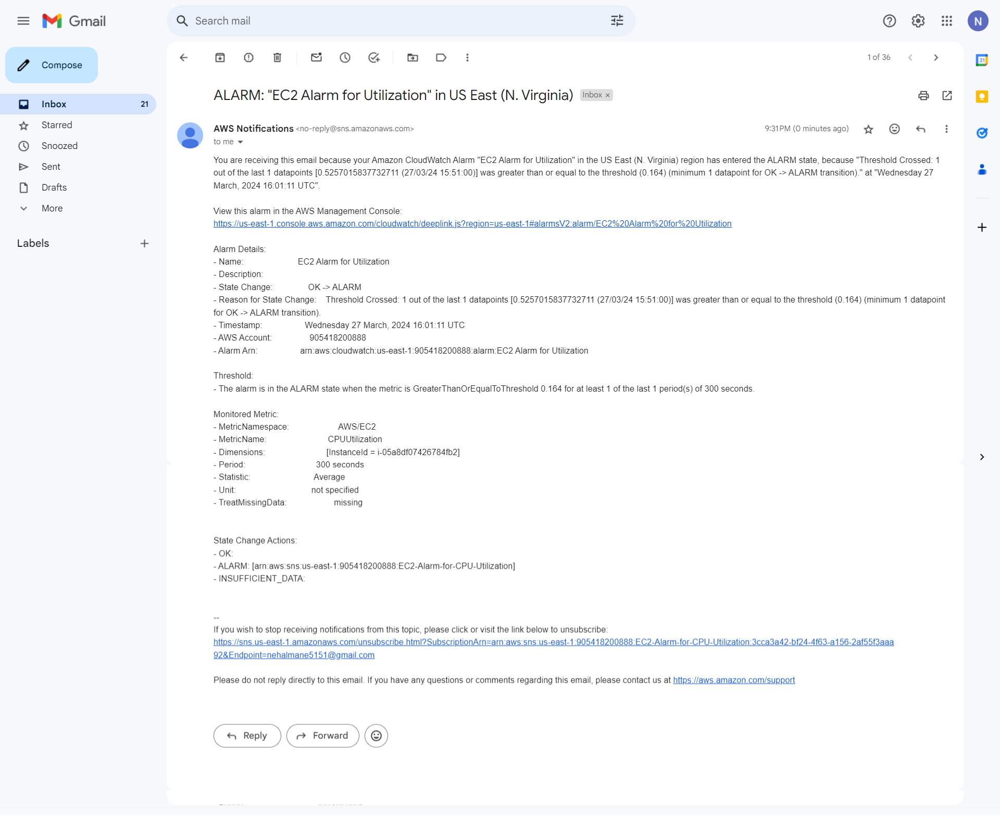

# Cloud Watch Alarm

**1. Create one EC2 Instance** 

**2. Search `Cloud Watch` in search bar and click on that**

**3. When we land on our dashboard for cloud watch, Click on `Create alarm`**

**4. Again click on `Create alarm`**

**5. After that click on `Select metrics`**

**6. Click on `EC2` and then click on `Per-Instance Metrics`**

**7. Search our EC2 instance and select `Source: CUP Utilization` for alarm**

**8. In Conditions select `Greater/Equal` option and give threshold value(0.164) and click on Next button**

**9. In Configure Actions: Select `Create new topic` and then give topic name, put our email id where we want this email to arrive and then click on `create topic`**
- In alarm- It means that whenever the value moves above the threshold that just set will generate an alarm for us
- SNS Topic - It is `Simple Notification Service` 

**10. default Auto Scaling, EC2 action and System Manager action and click on `Next` button**

**11. Enter Alarm Name and click on Next button**

**12. Now we can see that maximum cpu utilization and click on `Create alarm`**

**13. We can see Successfully created Ec2 Alarm for Utilization**

**14. We have Received an email for AWS notification, Confirm my Subscription so that we receive all of these emails**

**15. Subscription is now confirmed**

**16. Go to Alarm page and click on alarm name**

**17. Go to Alarm notification, here we can see we set the threshold 0.164 but it reached to 0.526 for some reasons**   

**18. And same way it triggered an alarm and email notification for this particular thing in that we can it gives all of the information related to what the event occurred**

