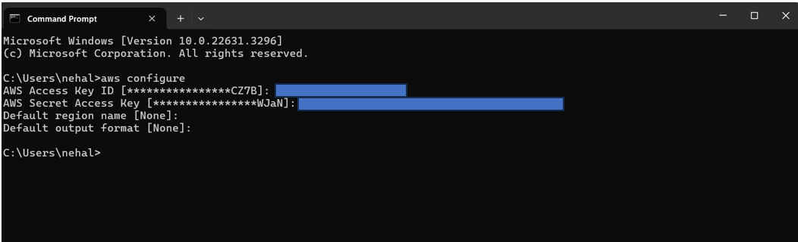

# Creating EC2 Instance Using AWS CLI

**1. Log in to AWS console and search and click 'AMI'**

**2. Then go to users page and then click on 'Create User'**

**3. Enter meaningful name for user and then click on Next**

**4. In Set permissions page select user group and click on Next**

**5. Then click on user name**

**6. Go to security Credentials tab and click on 'Create access key' button for creating Access keys**

**7. Select 'Command Line Interface(CLI) and click on Next button**

**8. without filling anything click on 'Create access key'**

**9. Then download the .csv file and click on Done button**

- Download AWS CLI

**10. Browse 'Install or update to the latest version of the AWS CLI' and click on download link**

**11. Double click on download file and then next..and then click on install**

**12. After that open CMD and type: `aws configure`**
- Enter AWS Access Key ID
- Enter AWS Secret Access Key

**13. For Checking the list of running Instances type: `aws ec2 describe-instance --region us-east-1`**

**14. For Creating EC2 instance copy the AMI ID**

**15. For Creating EC2 instance type: `aws ec2 run-instances --image-id=ami-080e1f13689e07408 --instance-type=t2.micro --region us-east-1` and enter**

**16. Checking EC2 instance is create or not for that go to instances page and refresh it, then we can see the created Instance**

