# IAM Account Give `AmazonEC2FullAccess` Permission Policy

**1. On the Console Home page, select the IAM service**

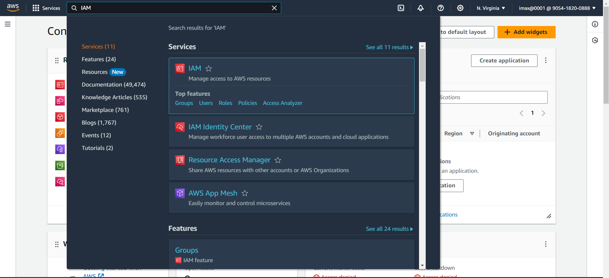

**2. In the navigation pane, select Users and then select Add users**

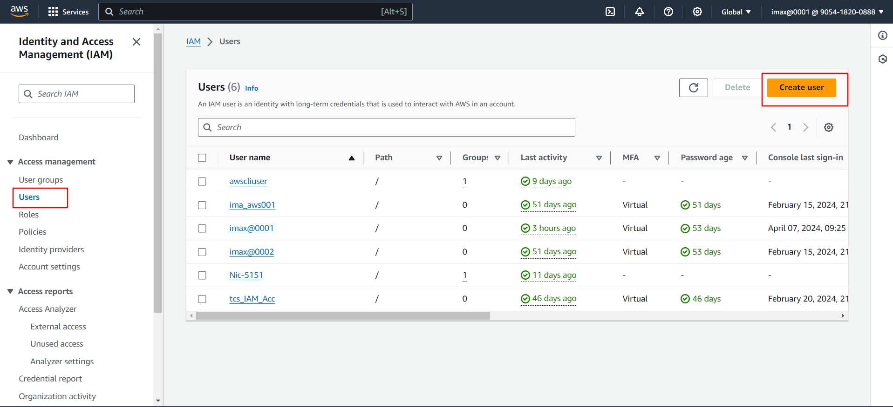

**3. On the Specify user details page, under User details, in User name, enter the name for the new user**
- Select Provide user access to the – AWS Management Console optional: This produces AWS Management Console sign-in credentials for the new user.
- Select `I want to create an IAM user` 
- For Console password select: `Custom password` – The user is assigned the password that you enter in the box.
- Uncheck the `Users must create a new password at next sign-in` and click on `Next` button.

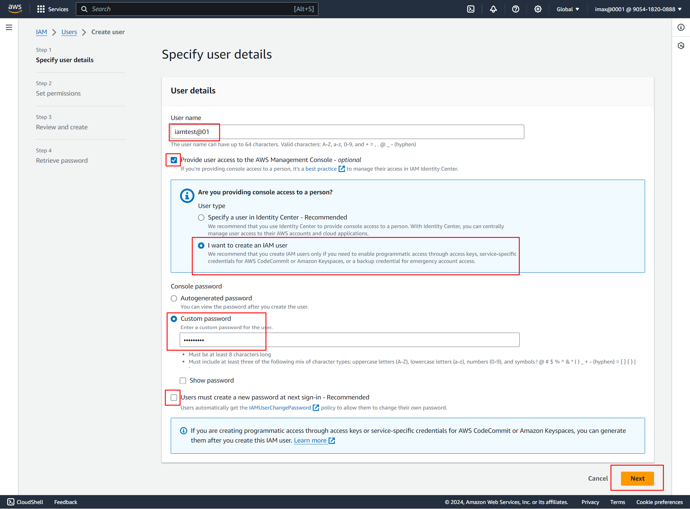

**4. On the Set permissions page, specify how you want to assign permissions for this user**
- Select: `Attach policies directly`: Select this option to see a list of the AWS managed and customer managed policies in your account
- In Permission Policies search EC2Full and select `AmazonEC2FullPolicy` (Allow EC2, Elastic Load Balancing, Cloud Watch, AutoScaling)and click on `Next` button.

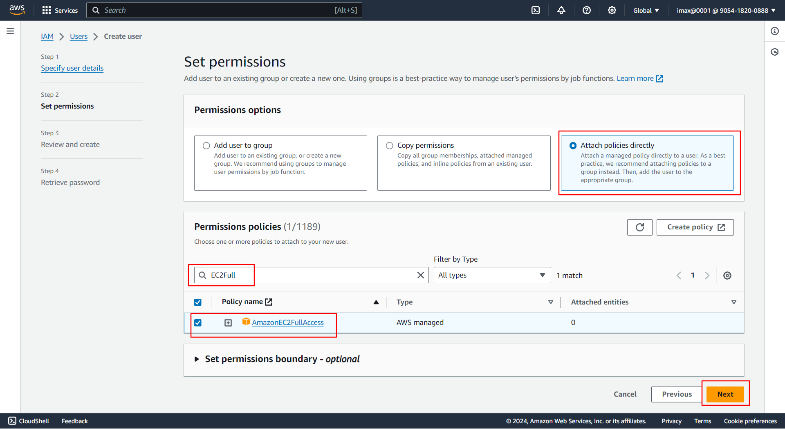
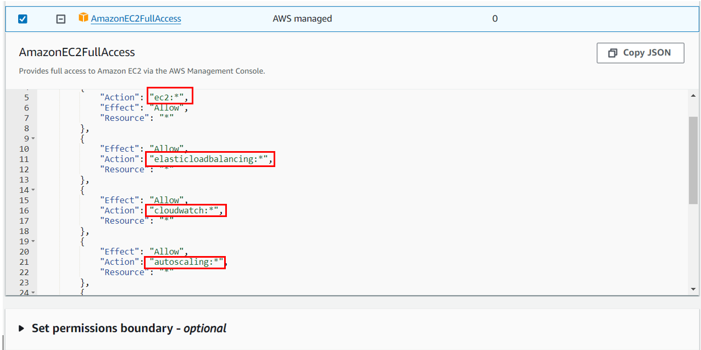

**5. On the Review and create page click on `Create user` button**

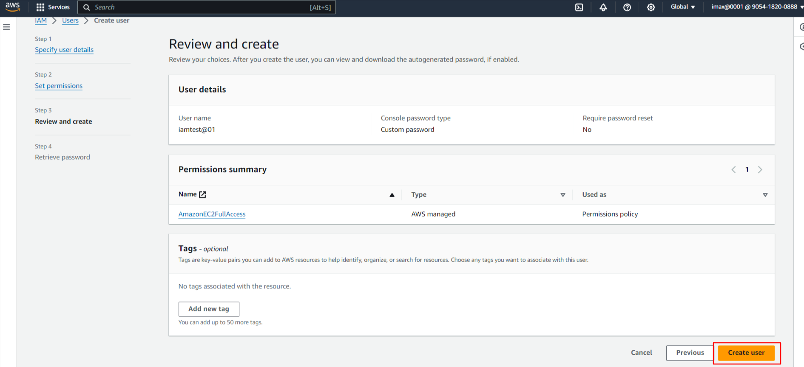

**6. On the Retrieve password page**
- Select Show next to the password to view the user's password so that you can record it manually.
- Select Download .csv to download the user's sign in credentials as a .csv file that you can save to a safe location.
- After that click on `Returns to user list`, go to list page

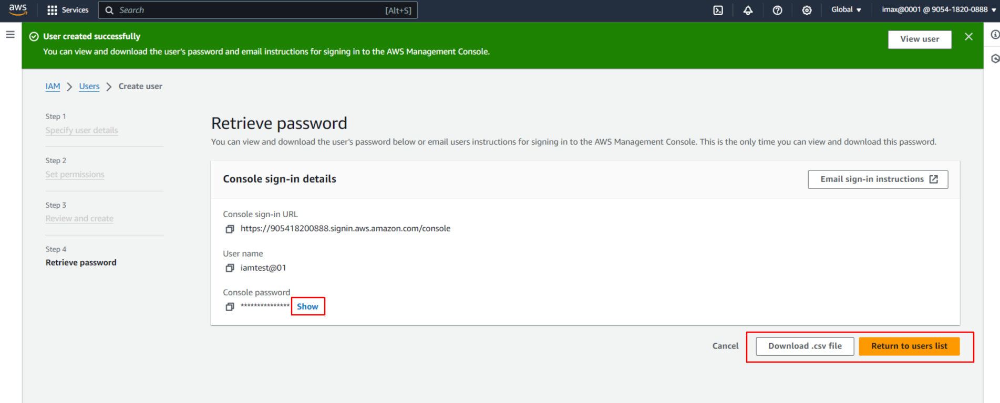

**7. We can see that `IAM user` is created successfully with `AmazonEC2FullAccess` Permission Policy**

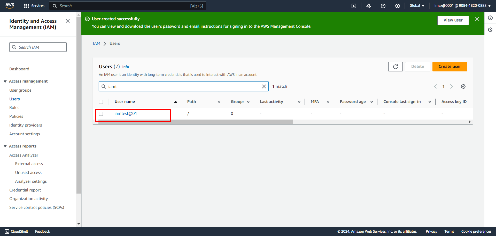

**8. For Checking permission**
- In Private window Sign In IAM Account

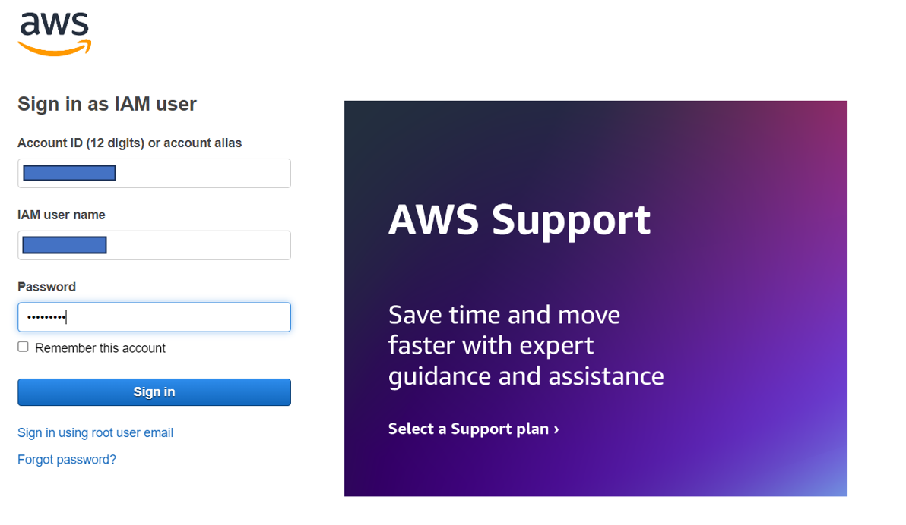

- After Sign In, In Console page we can see that Applications: Access denied, Cost and usage: Access denied

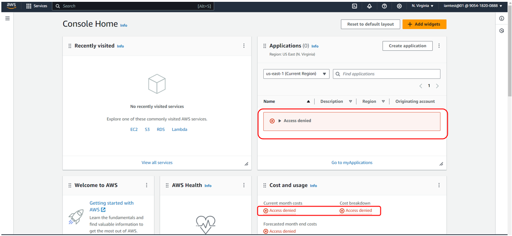

- After that we try to Create S3 Bucket then it shows error message like `To create a bucket, the s3:CreateBucket permission is required.` Because we not give S3 access

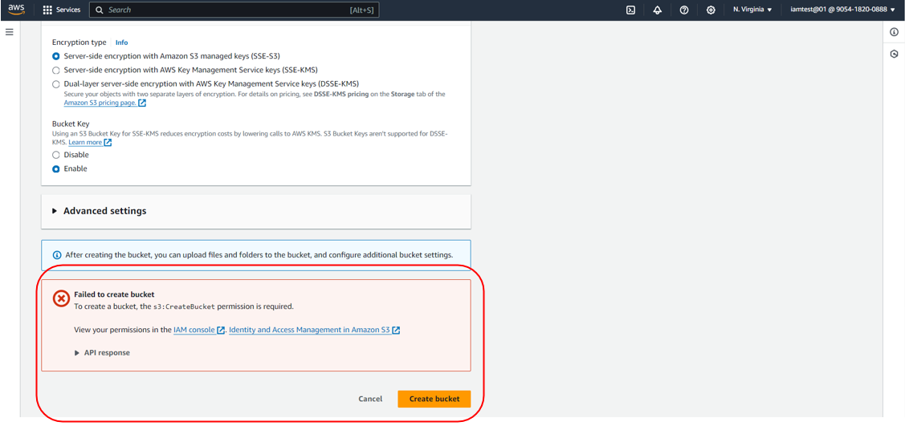

- We can Create EC2 Instance, Stop, Start, Reboot, Terminate the Instance, We can Create Load Balancer and attache to the EC2 instance.

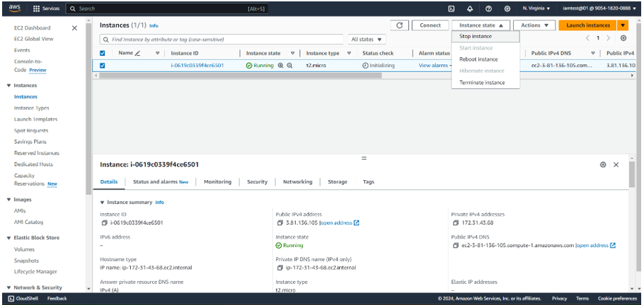
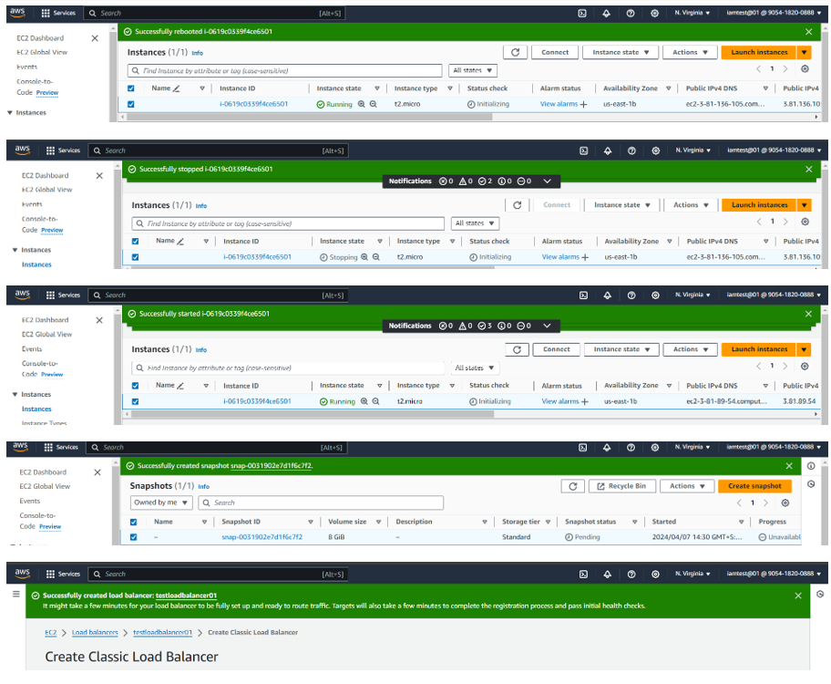