# IAM Account Give `AmazonEC2FullAccess` Permission Policy

**1. On the Console Home page, select the IAM service**

**2. In the navigation pane, select Users and then select Add users**

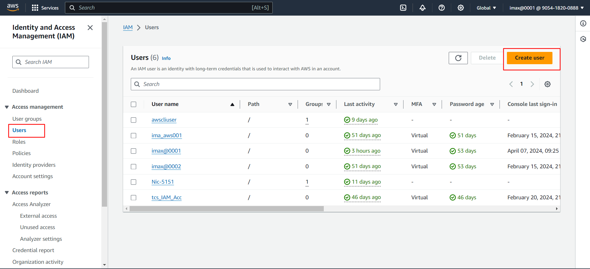

**3. On the Specify user details page, under User details, in User name, enter the name for the new user**
- Select Provide user access to the – AWS Management Console optional: This produces AWS Management Console sign-in credentials for the new user.
- Select `I want to create an IAM user` 
- For Console password select: `Custom password` – The user is assigned the password that you enter in the box.
- Uncheck the `Users must create a new password at next sign-in` and click on `Next` button.

**4. On the Set permissions page, specify how you want to assign permissions for this user**
- Select: `Attach policies directly`: Select this option to see a list of the AWS managed and customer managed policies in your account
- In Permission Policies search EC2Full and select `AmazonEC2FullPolicy` (Allow EC2, Elastic Load Balancing, Cloud Watch, AutoScaling)and click on `Next` button.

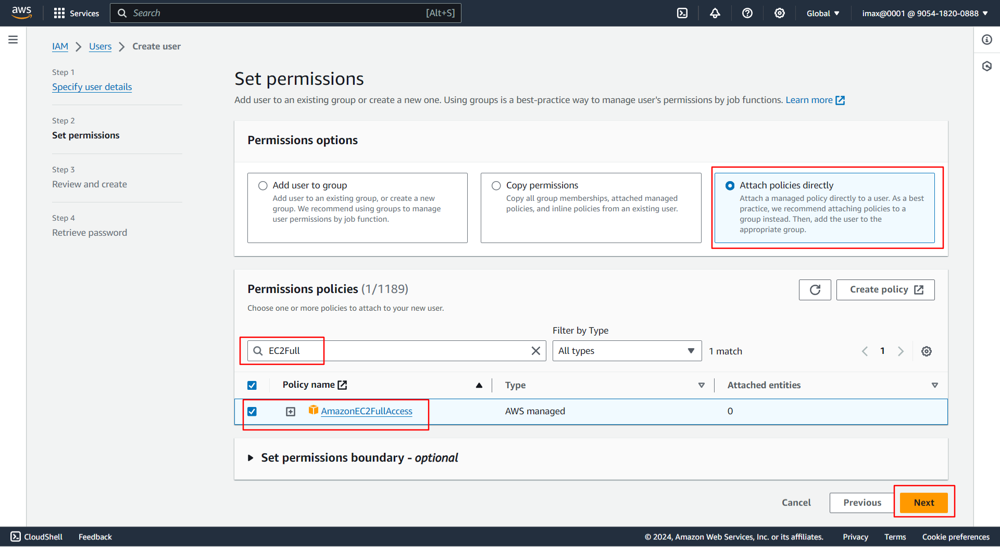
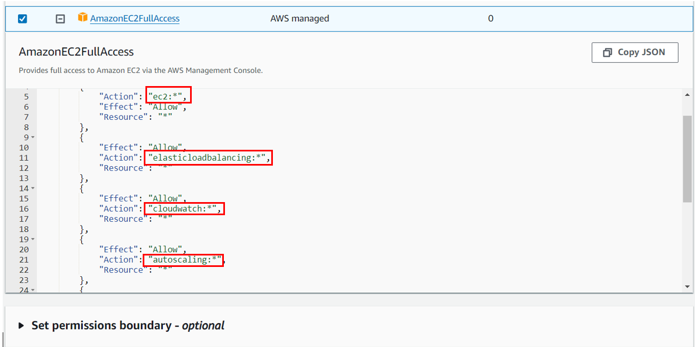

**5. On the Review and create page click on `Create user` button**

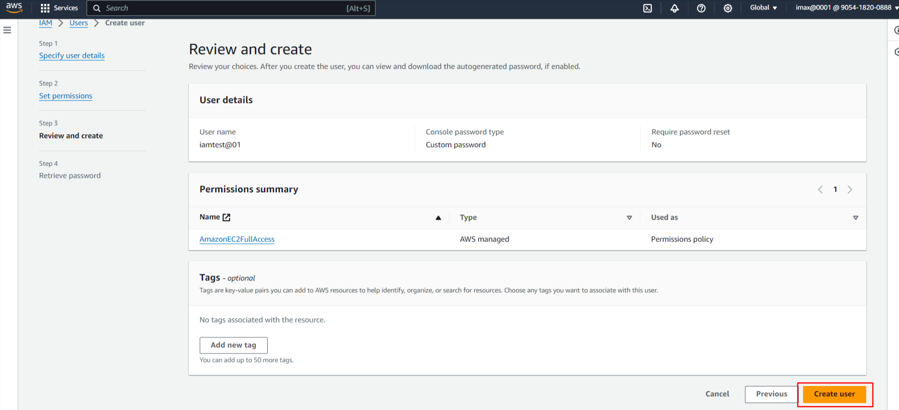

**6. On the Retrieve password page**
- Select Show next to the password to view the user's password so that you can record it manually.
- Select Download .csv to download the user's sign in credentials as a .csv file that you can save to a safe location.
- After that click on `Returns to user list`, go to list page

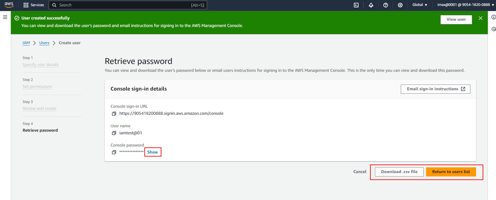

**7. We can see that `IAM user` is created successfully with `AmazonEC2FullAccess` Permission Policy**

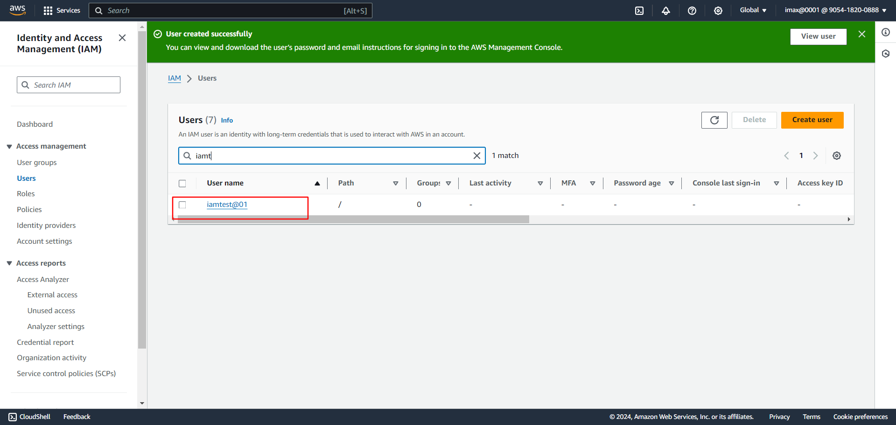

**8. For Checking permission**
- In Private window Sign In IAM Account

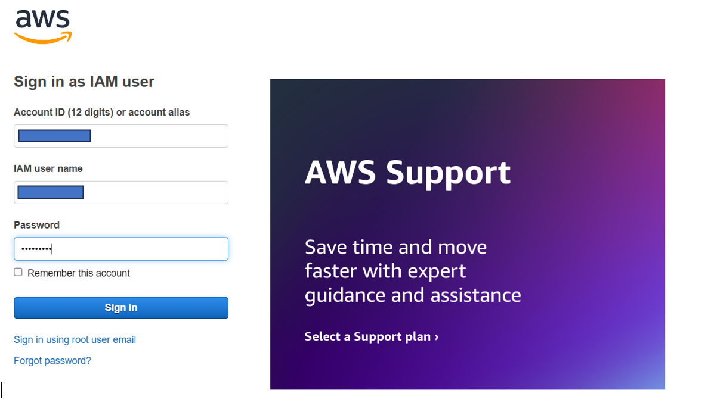

- After Sign In, In Console page we can see that Applications: Access denied, Cost and usage: Access denied

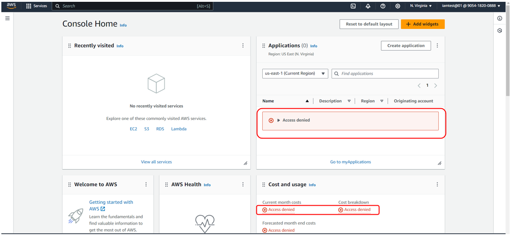

- After that we try to Create S3 Bucket then it shows error message like `To create a bucket, the s3:CreateBucket permission is required.` Because we not give S3 access

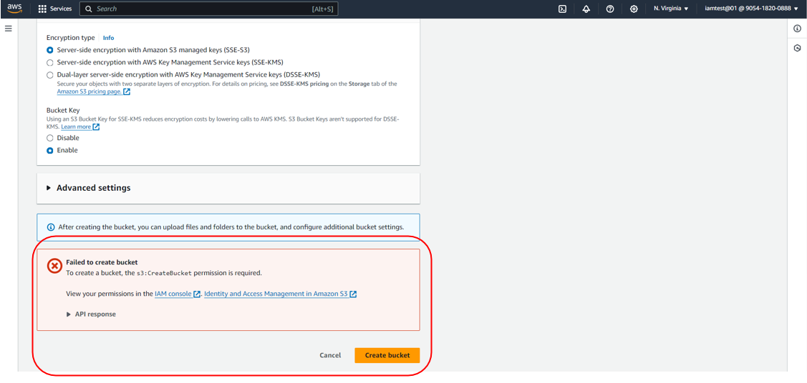

- We can Create EC2 Instance, Stop, Start, Reboot, Terminate the Instance, We can Create Load Balancer and attache to the EC2 instance.

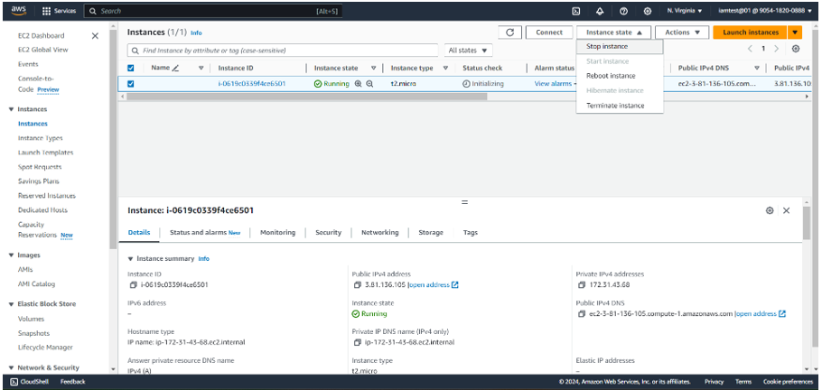
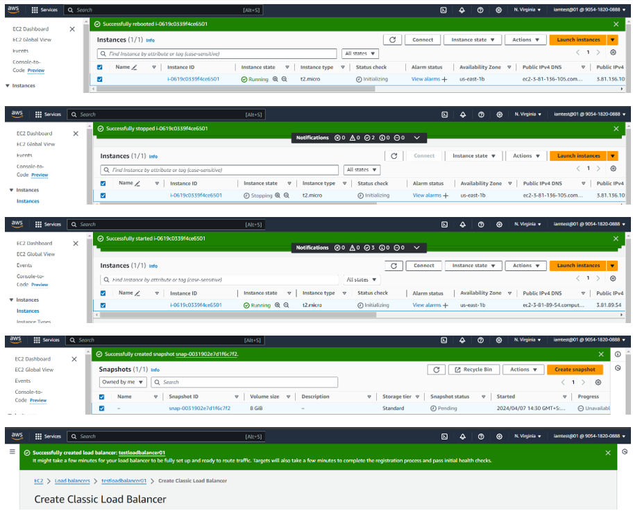

**Permissions**
- Launch new EC2 Instance across various instance type, Amazon Machine Image(AMIs) and configurations
- Stop, Start, Reboot and terminate running instance
- Create and manage Auto Scaling groups for automatically scaling your EC2 instances based on demand.
- Modify instance security groups, controlling inbound and outbound network traffic 
- Attach and detach Elastic Block Storage (EBS) volumes to instances for persistent storage 
- Allocate and associate Elastic IP addresses for static IP assignment to instances
- Configure instance metadata & user data scripts for customization during launch.
- Connect to running instances via SSH or Remote Desktop Protocol(RDP)
- View instance logs and console input 
- Terminate remote desktop connections to instances
- Create and manage Amazon Machine Image(AMIs) from existing instance.
- Request and manage spot Fleet requests to launch large number of EC2 instances cost effective.
- Generating EC2 full access is highly powerful and should be done with utmost caution. Its generally recommended to use the principle of least privilege and grant only the specific permissions required for a user or roles tasks.
- Regular review and audit IAM policies to ensure they are aligned with current needs and don't grant unnecessary access