# Install Prometheus on EC2 Instance

**1. Create one EC2 Instance**

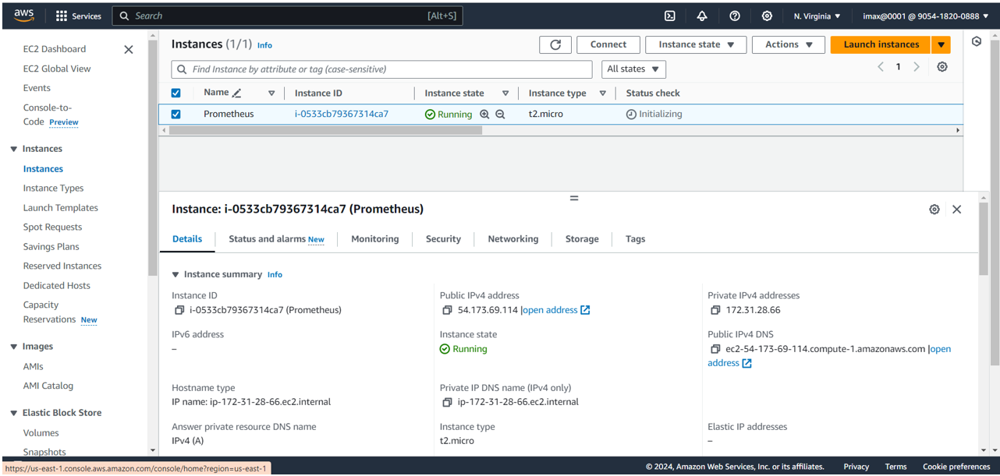

**2. SSH it**

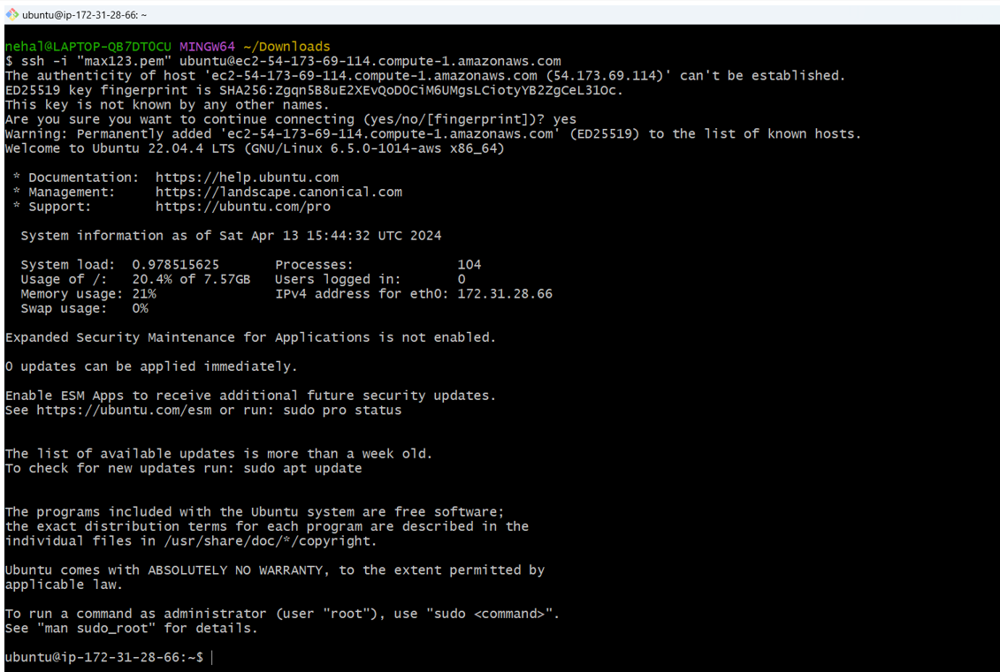

**3. Run below commands**

- Make dir: `mkdir prometheus`

- Go to dir: `cd prometheus`

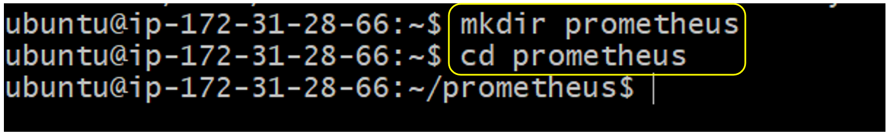

- For Download Prometheus: `wget https://github.com/prometheus/prometheus/releases/download/v2.45.1/prometheus-2.45.1.linux-amd64.tar.gz`

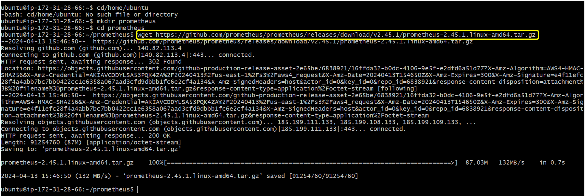

- For Extract: `tar -xvzf prometheus-2.45.1.linux-amd64.tar.gz`

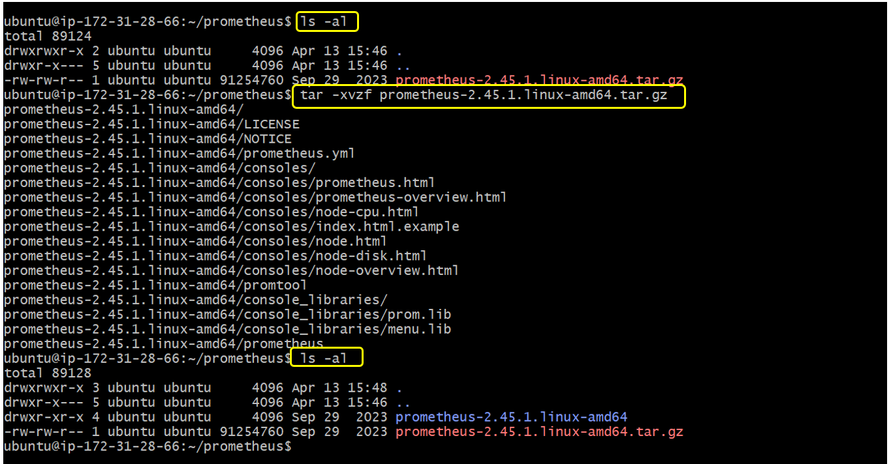
- `cd prometheus-2.45.1.linux-amd64`

- `ls -al`(Here `prometheus`: Executable file and `prometheus.yml`:Config file)

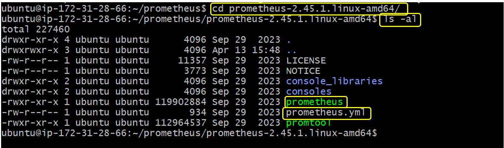

- `./prometheus` (Here we can see the address and port:9090)

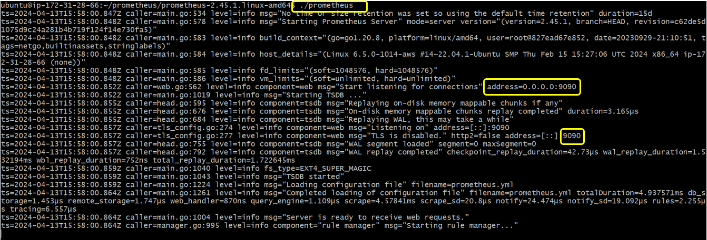

**4. Go Instances, choose security tab and click on Security group**

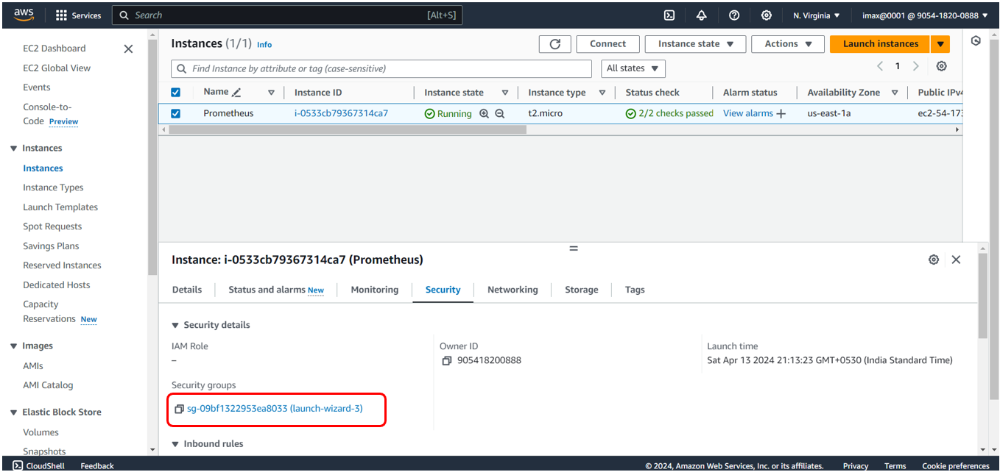

**5. Click on `Edit inbound rules`**

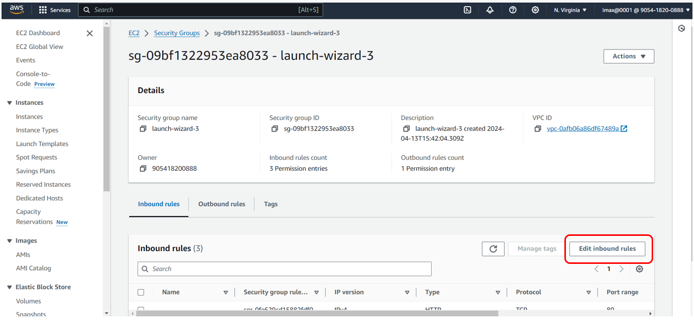

**6. Add rule: port:9090 and Source: anywhere**

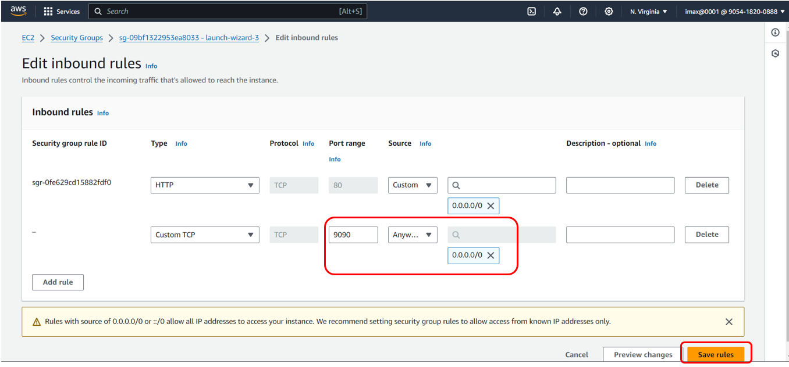

**7. Copy the public ip**

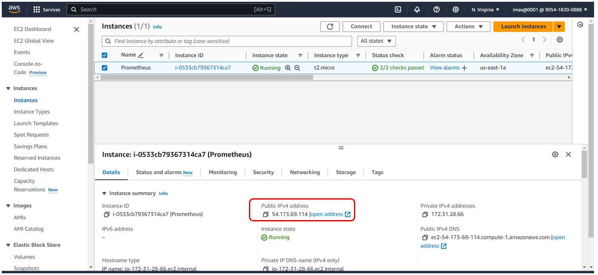

**8. Open browser put public ip and also add port like(54.173.69.114:9090)**

- Prometheus open successfully

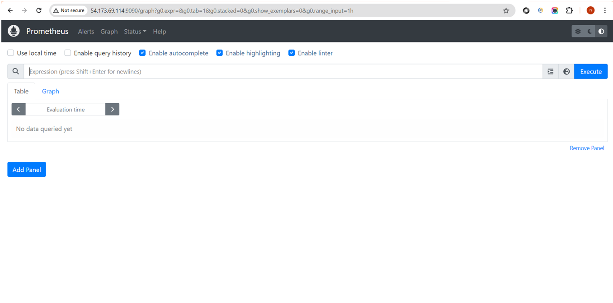

**9. I Just try to open one graph on Prometheus**

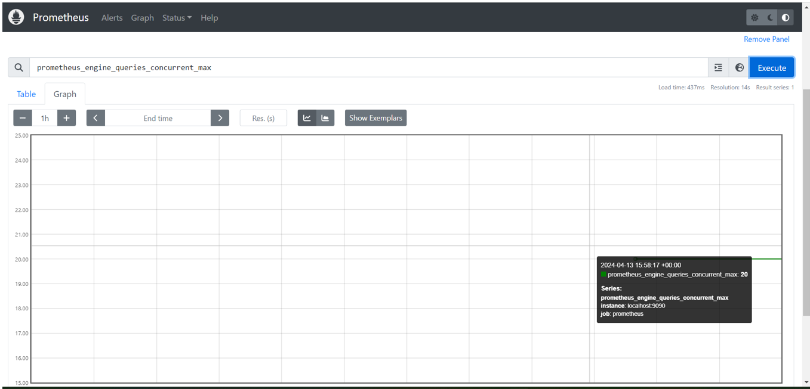