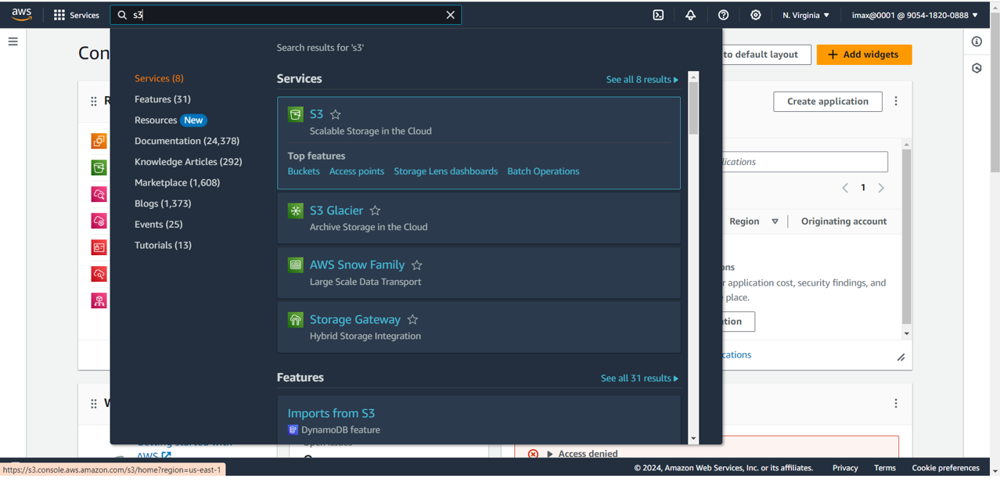
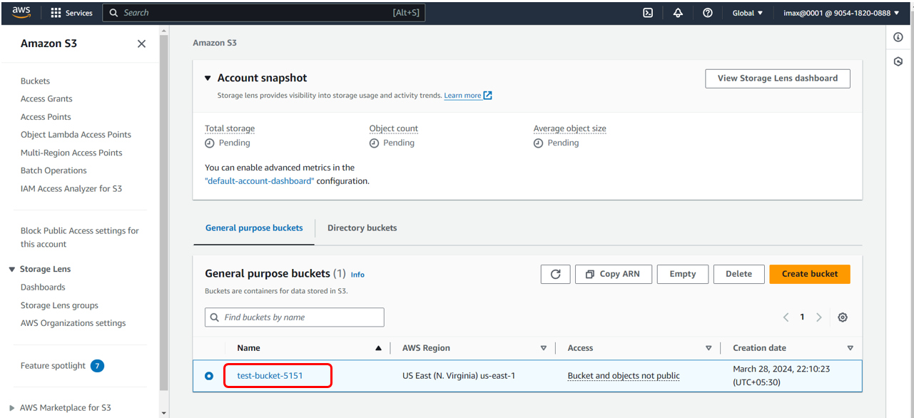
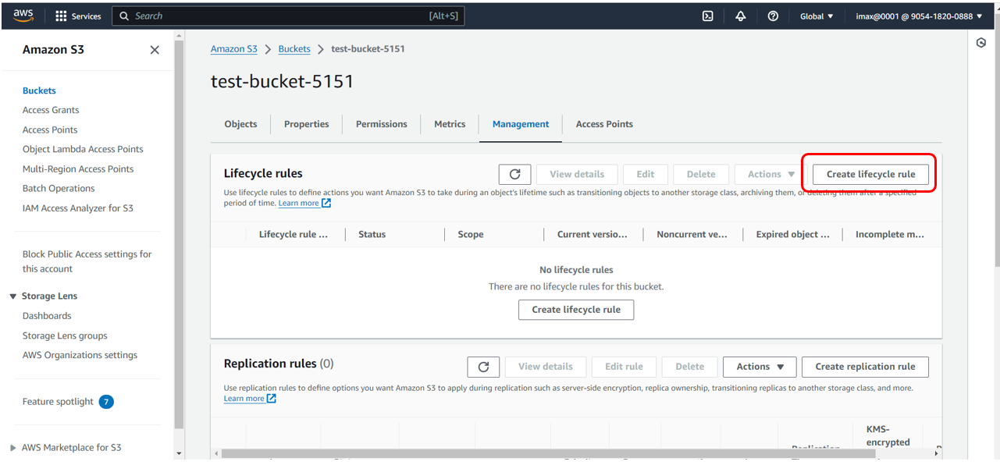
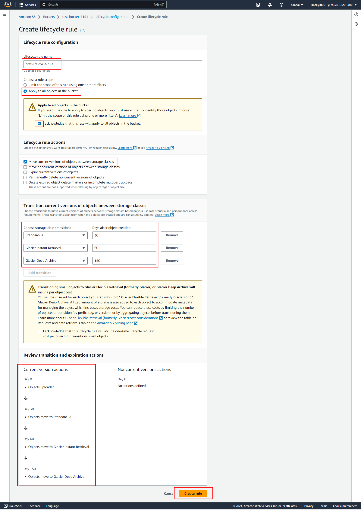

# LifeCycle Management With AWS S3

**1. follow `S3Bucket(AWS-CLI).md` file to Create S3 Bucket**
**, After that go to S3 page and click on bucket name**

**2. Click on `Create lifecycle rule`**

**3. In Create lifecycle rule page:**
- Enter meaningful name of Lifecycle rule
-Choose a rule scope: Apply to all objects in bucket
- click on acknowledge checkbox
- select Lifecycle rule action: Move current versions of objects between storage classes

