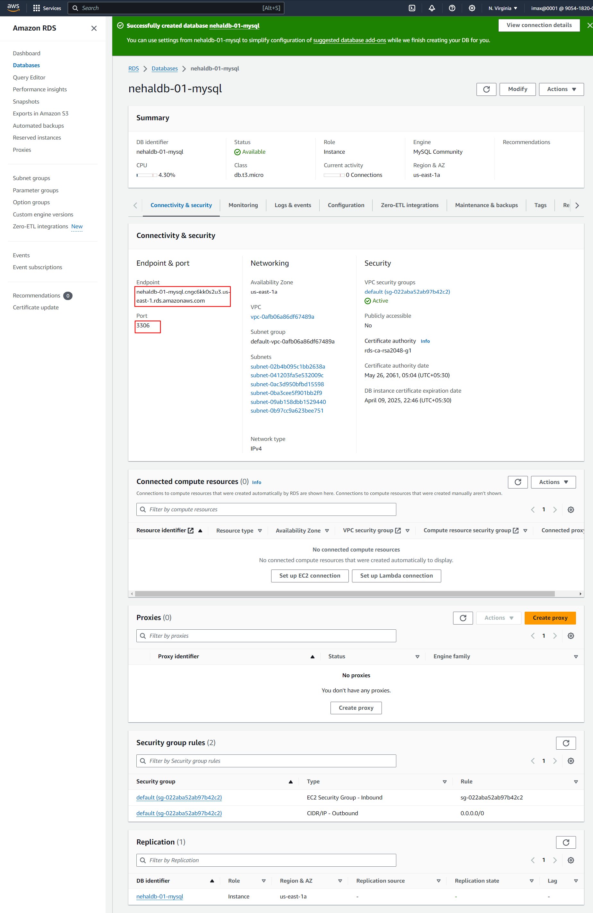
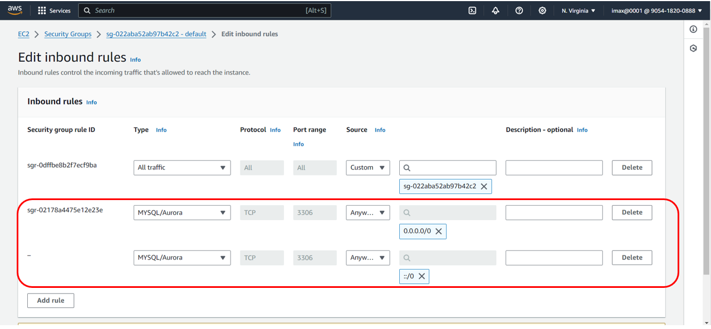
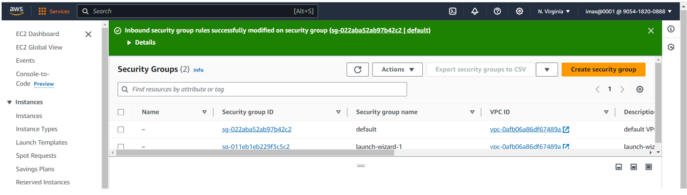
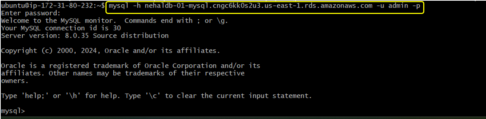
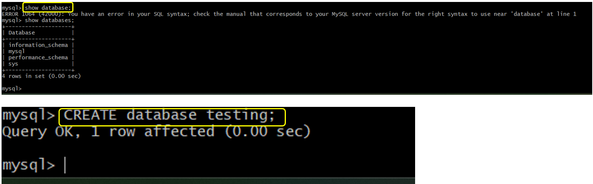
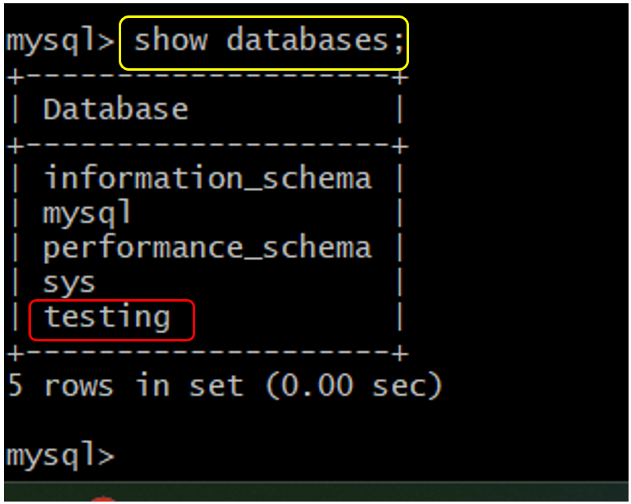
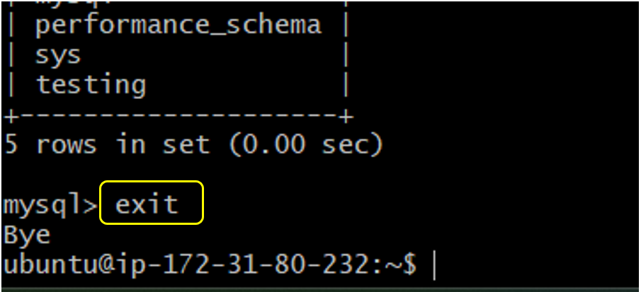

# Create DataBase Using RDS(Relational Database Service) Connect to EC2 Instance

**1. On the Console Home page, select the `RDS` service**

**2. In the navigation pane, select `Database` and then select `Create database`**

**3. We Got one Suggested window click on `Close` button**

**4. In Create database page select Engine Options:`My SQL`, Templates: `Free tire`, Enter meaningful name in DB instance identifier, Enter Password, Availability Zone: `us-east-1a`, Database authentications option: `Password authentication` and few default fields same and click on `Create database`**

- In Connectivity & security tab `Endpoint` and `Port` are important things

**5. database is successfully created now status of database is `Backing-up` after few min status change as `Available`, After that click on `DB identifier`**

**6. Create EC2 instance and ssh it**

**7. After that run some commands**
- for update: `sudo apt-get update`
- for install mysql: `sudo apt-get install mysql-client`
- login mysql: `mysql -u admin -p` (But it show Error because my sql port is 3306, but we not enable port 3306 in security group thats why its shows error )

**8. Go to security group page> `Inbound rules` tab and click on `Edit Inbound rule`**

**9. In Edit inbound rules page**
- Add rule: MYSQL/Aurora: 3306: Anywhere(IPv4)
- Add rule: MYSQL/Aurora: 3306: Anywhere(IPv6)
- after that click on `Save rule`

**10. Go to terminal and type command `mysql -h nehaldb-01-mysql.cngc6kk0s2u3.us-east-1.rds.amazonaws.com -u admin -p`**
- In above command: `nehaldb-01-mysql.cngc6kk0s2u3.us-east-1.rds.amazonaws.com` is host url
- After that enter password, now we connect with database

**11. Run some sql commands**
- `show databases;`
- `CREATE database testing;`

- `show databases;` here we can see our database created(testing)

**12. For Exit from mysql type: `exit`**

