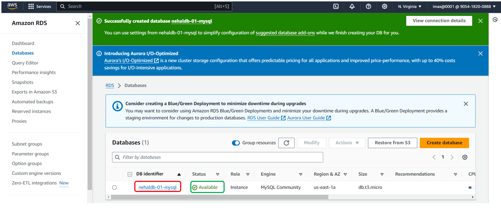

# Create DataBase Using RDS(Relational Database Service) Connect to EC2 Instance

**1. On the Console Home page, select the `RDS` service**

**2. In the navigation pane, select `Database` and then select `Create database`**

**3. We Got one Suggested window click on `Close` button**

**4. In Create database page select Engine Options:`My SQL`, Templates: `Free tire`, Enter meaningful name in DB instance identifier, Enter Password, Availability Zone: `us-east-1a`, Database authentications option: `Password authentication` and few default fields same and click on `Create database`**

**5. database is successfully created now status of database is `Backing-up` after few min status change as `Available`, After that click on `DB identifier`**

**6. Create EC2 instance and ssh it**

**7. After that run some commands**
- for update: `sudo apt-get update`
- for install mysql: `sudo apt-get install mysql-client`
- login mysql: `mysql -u admin -p` (But it show Error because my sql port is 3306, but we not enable port 3306 in security group thats why its shows error )

**8. 

